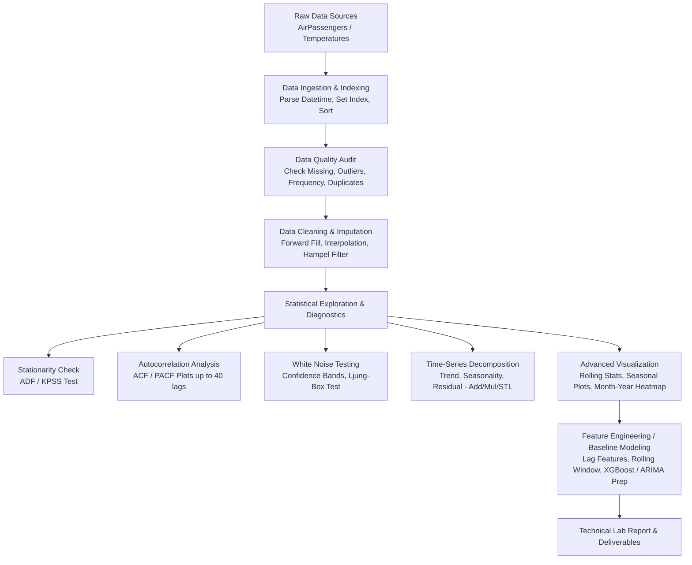
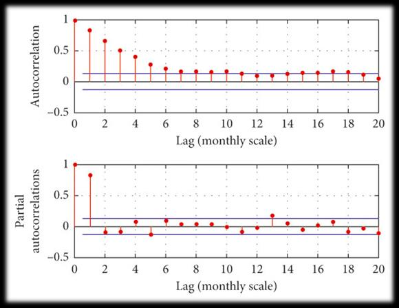
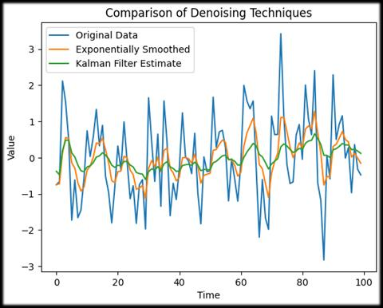
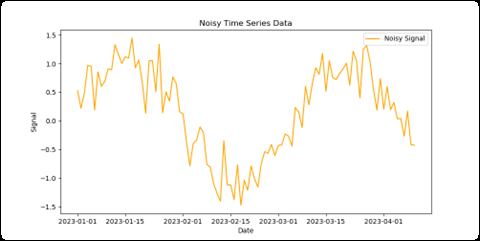
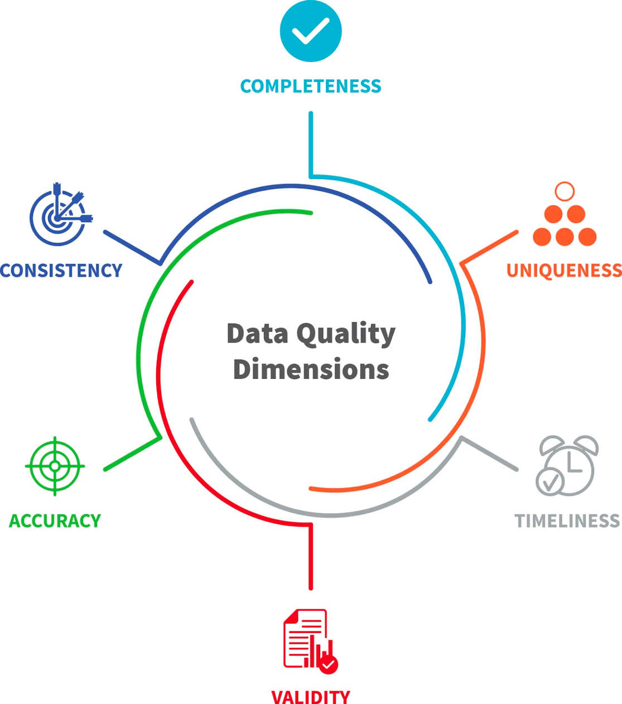

# BÀI THỰC HÀNH SỐ 2: KHÁM PHÁ ĐẶC TÍNH DỮ LIỆU CHUỖI THỜI GIAN
## (Time Series Exploratory Data Analysis & Data Quality Engineering)

> **Môn học:** Quản lý & Khai phá Chuỗi Thời gian (QLCTG)  
> **Đơn vị:** Khoa Công nghệ Thông tin - Trường Đại học Giao thông Vận tải TP.HCM (UTH)  
> **Giảng viên phụ trách:** PhD. Nguyễn Thị Khánh Tiên (`tienntk@ut.edu.vn`)  
> **Nhóm thực hiện:** Nhóm 7 (`QLCTG_nhom7`)  
> **GitHub Repository:** [https://github.com/HADUYHUNG-0912/QLCTG_nhom7.git](https://github.com/HADUYHUNG-0912/QLCTG_nhom7.git)

---

## MỤC LỤC TỔNG QUAN

1. [Phần 1: Kiến trúc Triển khai Dự án (Project Architecture)](#phan-1-kien-truc-trien-khai-du-an)
   - [1.1. Luồng xử lý dữ liệu chuẩn (End-to-End Pipeline)](#11-luong-xu-ly-du-lieu-chuan)
   - [1.2. Cấu trúc thư mục chuẩn hóa (Project Structure)](#12-cau-truc-thu-muc-chuan-hoa)
   - [1.3. Ngăn xếp công nghệ & Thư viện (Tech Stack)](#13-ngan-xep-cong-nghe--thu-vien)
2. [Phần 2: Cơ sở Lý thuyết & Phương pháp luận (Theoretical Foundations)](#phan-2-co-so-ly-thuyet--phuong-phap-luan)
   - [2.1. Hàm tự tương quan (Autocorrelation / ACF)](#21-ham-tu-tuong-quan-autocorrelation--acf)
   - [2.2. Phương sai và Hiệp phương sai (Variance & Covariance)](#22-phuong-sai-va-hiep-phuong-sai)
   - [2.3. Cách đọc và phân tích biểu đồ ACF & PACF](#23-cach-doc-va-phan-tich-bieu-do-acf--pacf)
   - [2.4. Khái niệm và Kiểm định Nhiễu trắng (White Noise)](#24-khai-niem-va-kiem-dinh-nhieu-trang-white-noise)
   - [2.5. Phân rã chuỗi thời gian (Time-Series Decomposition)](#25-phan-ra-chuoi-thoi-gian-time-series-decomposition)
   - [2.6. 11 Vấn đề chất lượng dữ liệu Time Series & Giải pháp kỹ thuật](#26-11-van-de-chat-luong-du-lieu-time-series--giai-phap-ky-thuat)
   - [2.7. Trực quan hóa dữ liệu & Ứng dụng XGBoost cho Time Series](#27-truc-quan-hoa-du-lieu--ung-dung-xgboost-cho-time-series)
3. [Phần 3: Đề bài & Hướng dẫn Thực hành Chi tiết Lab 2 (Lab Assignment)](#phan-3-de-bai--huong-dan-thuc-hanh-chi-tiet-lab-2)
   - [Mục tiêu thực hành & Dữ liệu mẫu](#muc-tieu-thuc-hanh--du-lieu-mau)
   - [Bài tập 1: Tính và phân tích biểu đồ ACF/PACF](#bai-tap-1-tinh-va-phan-tich-bieu-do-acfpacf)
   - [Bài tập 2: Kiểm định chuỗi White Noise](#bai-tap-2-kiem-dinh-chuoi-white-noise)
   - [Bài tập 3: Phân rã chuỗi thời gian (Classical vs STL Decomposition)](#bai-tap-3-phan-ra-chuoi-thoi-gian)
   - [Bài tập 4: Kiểm tra và xử lý chất lượng dữ liệu (Data Quality Cleaning)](#bai-tap-4-kiem-tra-va-xu-ly-chat-luong-du-lieu)
   - [Bài tập 5: Trực quan hóa chuyên sâu chuỗi thời gian](#bai-tap-5-truc-quan-hoa-chuyen-sau-chuoi-thoi-gian)
   - [Bài tập 6: Báo cáo kỹ thuật tổng kết (Comprehensive Report)](#bai-tap-6-bao-cao-ky-thuat-tong-ket)
4. [Phần 4: Hệ thống Câu hỏi Ôn tập Cuối chương 2](#phan-4-he-thong-cau-hoi-on-tap-cuoi-chuong-2)
5. [Phần 5: Hướng dẫn Phối hợp & Quy trình Git (Git Workflow Nhóm 7)](#phan-5-huong-dan-phoi-hop--quy-trinh-git)

---

<a name="phan-1-kien-truc-trien-khai-du-an"></a>
# PHẦN 1: KIẾN TRÚC TRIỂN KHAI DỰ ÁN (PROJECT ARCHITECTURE)

Nhằm đảm bảo quá trình thực hiện Lab 2 đạt tính khoa học, chuẩn hóa công nghiệp và dễ dàng phối hợp nhóm trên GitHub, dự án được thiết kế theo kiến trúc module hóa với pipeline tuần tự:

<a name="11-luong-xu-ly-du-lieu-chuan"></a>
### 1.1. Luồng xử lý dữ liệu chuẩn (End-to-End Pipeline)



<a name="12-cau-truc-thu-muc-chuan-hoa"></a>
### 1.2. Cấu trúc thư mục chuẩn hóa (Project Structure)

Toàn bộ mã nguồn, dữ liệu và báo cáo của Nhóm 7 được tổ chức theo tiêu chuẩn như sau:

```text
QLCTG_nhom7/
├── .git/                                 # Cấu hình Git repository
├── .gitignore                            # Khai báo file bỏ qua (cache, venv, data lớn)
├── README.md                             # Tổng quan dự án nhóm
├── requirements.txt                      # Danh sách các thư viện phụ thuộc
└── LAB2/
    ├── README.md                         # TÀI LIỆU CHUẨN HÓA KIẾN TRÚC & ĐỀ BÀI (File này)
    ├── assets/                           # Hình ảnh, sơ đồ minh họa lý thuyết
    │   ├── fig_1_bia_chuong_2.jpeg
    │   ├── fig_2_acf_pacf_bieu_do.jpeg
    │   ├── fig_3_white_noise_cong_thuc.jpeg
    │   ├── fig_4_white_noise_acf.png
    │   ├── fig_5_data_quality_dimensions.png
    │   └── fig_6_data_quality_lifecycle.png
    ├── data/
    │   ├── raw/                          # Dữ liệu gốc (AirPassengers.csv, Daily-Min-Temperatures.csv)
    │   └── processed/                    # Dữ liệu đã làm sạch & tiền xử lý
    ├── notebooks/
    │   └── Lab2_TimeSeries_EDA.ipynb     # Jupyter Notebook thực hành toàn bộ bài tập 1-6
    ├── src/                              # Mã nguồn Python tái sử dụng
    │   ├── __init__.py
    │   ├── data_loader.py                # Đọc dữ liệu, thiết lập DatetimeIndex
    │   ├── quality_audit.py              # Kiểm tra missing, outlier, duplicate
    │   ├── decomposition_utils.py        # Hàm phân rã Classical & STL
    │   └── visualization.py              # Vẽ biểu đồ rolling, seasonal plot, heatmap
    └── reports/
        ├── Lab2_Report_Group7.pdf        # Báo cáo kỹ thuật hoàn chỉnh
        └── figures/                      # Các biểu đồ xuất ra từ notebook
            ├── acf_pacf_plot.png
            ├── white_noise_comparison.png
            ├── decomposition_components.png
            ├── data_cleaning_before_after.png
            └── seasonality_heatmap.png
```

<a name="13-ngan-xep-cong-nghe--thu-vien"></a>
### 1.3. Ngăn xếp công nghệ & Thư viện (Tech Stack)

Dự án sử dụng Python 3.10+ cùng hệ sinh thái Data Science / Time Series tiêu chuẩn:
- **Xử lý & Cấu trúc dữ liệu:** `pandas` (>= 2.0.0), `numpy` (>= 1.24.0)
- **Thống kê & Chuỗi thời gian chuyên sâu:** `statsmodels` (>= 0.14.0), `scipy` (>= 1.10.0)
- **Học máy & Dự báo:** `scikit-learn` (>= 1.3.0), `xgboost` (>= 2.0.0)
- **Trực quan hóa đồ họa:** `matplotlib` (>= 3.7.0), `seaborn` (>= 0.12.0)
- **Môi trường Notebook tương tác:** `jupyterlab` / `ipykernel`

---

<a name="phan-2-co-so-ly-thuyet--phuong-phap-luan"></a>
# PHẦN 2: CƠ SỞ LÝ THUYẾT & PHƯƠNG PHÁP LUẬN (THEORETICAL FOUNDATIONS)


<a name="21-ham-tu-tuong-quan-autocorrelation--acf"></a>
### 2.1. Hàm tự tương quan (Autocorrelation / ACF)

Hàm tự tương quan (Autocorrelation Function - ACF) là một trong những công cụ then chốt hàng đầu để thấu hiểu cấu trúc nội tại của chuỗi thời gian trước khi xây dựng mô hình dự báo. 

- **Định nghĩa:** Tự tương quan là mức độ tương quan tuyến tính giữa một chuỗi thời gian với phiên bản trễ (lagged version) của chính nó tại các khoảng cách thời gian khác nhau ($k$):
  - $\text{Lag } k = 1 \implies$ Tương quan giữa $y_t$ và $y_{t-1}$.
  - $\text{Lag } k = 2 \implies$ Tương quan giữa $y_t$ và $y_{t-2}$.
  - $\text{Lag } k \implies$ Tương quan giữa $y_t$ và $y_{t-k}$.

- **Công thức tự tương quan tại độ trễ $k$:**
  $$\rho_k = \frac{\operatorname{Cov}(y_t, y_{t-k})}{\operatorname{Var}(y_t)} = \frac{\sum_{t=k+1}^{n} (y_t - \bar{y})(y_{t-k} - \bar{y})}{\sum_{t=1}^{n} (y_t - \bar{y})^2}$$

- **Miền giá trị:** $\rho_k \in [-1, 1]$:
  - $\rho_k \approx +1$: Tương quan thuận rất mạnh (giá trị quá khứ cao dẫn tới giá trị hiện tại cao).
  - $\rho_k \approx -1$: Tương quan nghịch rất mạnh (giá trị quá khứ cao dẫn tới giá trị hiện tại giảm).
  - $\rho_k \approx 0$: Không có tương quan tuyến tính giữa hai thời điểm.

- **Ý nghĩa cấu trúc theo từng độ trễ (Lags):**
  - **Lag nhỏ ($k = 1 \dots 3$):** Đo lường tính "ghi nhớ ngắn hạn" (short-term memory) $\implies$ xác định bậc mô hình Tự hồi quy Autoregressive $\text{AR}(p)$.
  - **Lag mùa vụ (ví dụ $k = 12$ cho dữ liệu tháng, $k = 7$ cho dữ liệu ngày):** Nhận diện tính mùa vụ (Seasonality) lặp đi lặp lại theo chu kỳ cố định.
  - **Lag lớn:** Nếu hệ số tự tương quan suy giảm rất chậm qua nhiều lag $\implies$ Chuỗi có **Xu hướng mạnh (Strong Trend)** hoặc không dừng (Non-stationarity).

---

<a name="22-phuong-sai-va-hiep-phuong-sai"></a>
### 2.2. Phương sai và Hiệp phương sai (Variance & Covariance)

Để hiểu rõ mẫu số và tử số của công thức ACF, cần phân biệt rõ hai đại lượng thống kê nền tảng:

#### A. Phương sai (Variance - $\operatorname{Var}$)
Phương sai đo lường mức độ biến thiên, phân tán của các điểm dữ liệu xung quanh giá trị trung bình của chính biến số đó:
$$\operatorname{Var}(Y) = \frac{1}{n}\sum_{t=1}^{n}(y_t - \bar{y})^2$$
- **Ý nghĩa:**
  - $\operatorname{Var}$ lớn $\implies$ Dữ liệu dao động mạnh, biên độ lớn, bất ổn định.
  - $\operatorname{Var}$ nhỏ $\implies$ Dữ liệu tập trung sát giá trị trung bình $\bar{y}$.
- **Ví dụ minh họa:**
  - Dãy $A = [10, 11, 10, 9, 10] \implies \bar{y} = 10$, các giá trị rất sát nhau $\implies \operatorname{Var}$ rất nhỏ.
  - Dãy $B = [10, 30, -5, 50, 2] \implies$ Phân tán cực kỳ rộng $\implies \operatorname{Var}$ lớn.

#### B. Hiệp phương sai (Covariance - $\operatorname{Cov}$)
Hiệp phương sai đo lường mức độ đồng biến thiên tuyến tính giữa hai biến số (hoặc giữa chuỗi hiện tại và chuỗi tại độ trễ $k$):
$$\operatorname{Cov}(X, Y) = \frac{1}{n}\sum_{t=1}^{n}(x_t - \bar{x})(y_t - \bar{y})$$
- **Ý nghĩa dấu của hiệp phương sai:**
  - $\operatorname{Cov}(X, Y) > 0$: Hai biến đồng hướng ($X$ tăng thì $Y$ có xu hướng tăng).
  - $\operatorname{Cov}(X, Y) < 0$: Hai biến nghịch hướng ($X$ tăng thì $Y$ có xu hướng giảm).
  - $\operatorname{Cov}(X, Y) \approx 0$: Không có mối liên hệ tuyến tính giữa $X$ và $Y$.

---

<a name="23-cach-doc-va-phan-tich-bieu-do-acf--pacf"></a>
### 2.3. Cách đọc và phân tích biểu đồ ACF & PACF



#### A. Hàm tự tương quan toàn phần (ACF - Autocorrelation Function)
- Đo lường tương quan giữa $y_t$ và $y_{t-k}$, **bao gồm cả tác động gián tiếp** truyền qua các mốc trung gian ($y_{t-1}, y_{t-2}, \dots$).
- **Ứng dụng nhận diện:**
  - **Xu hướng (Trend):** Biểu đồ ACF bắt đầu ở giá trị cao tại lag 1 và **suy giảm rất chậm (decays slowly / tail-off)** qua các độ trễ tiếp theo.
  - **Mùa vụ (Seasonality):** Biểu đồ ACF xuất hiện các đỉnh dao động sóng (peaks) lặp lại đều đặn tại các bội số của chu kỳ mùa vụ (lag = $s, 2s, 3s \dots$).
  - **Thành phần Trung bình trượt (Moving Average - MA):** Xác định bậc $q$ của mô hình $\text{MA}(q)$.

#### B. Hàm tự tương quan từng phần (PACF - Partial Autocorrelation Function)
- Đo lường tương quan **trực tiếp** giữa $y_t$ và $y_{t-k}$ sau khi đã loại trừ hoàn toàn ảnh hưởng của tất cả các biến trễ trung gian ở giữa ($y_{t-1}, \dots, y_{t-k+1}$).
- **Ứng dụng nhận diện:**
  - **Thành phần Tự hồi quy (Autoregressive - AR):** Xác định bậc $p$ của mô hình $\text{AR}(p)$.
  - **Quy tắc cắt cụt (Cut-off):** Nếu PACF giảm đột ngột về 0 sau lag $p$, ta chọn mô hình $\text{AR}(p)$.

#### C. Bảng tóm tắt lựa chọn mô hình Box-Jenkins (ARIMA / SARIMA)

| Mẫu hình biểu đồ (Pattern) | Khuyến nghị mô hình | Ý nghĩa & Hành động |
| :--- | :--- | :--- |
| **ACF giảm chậm (tail-off)** | Cần sai phân $d \ge 1$ | Chuỗi có xu hướng, chưa dừng $\implies$ Lấy sai phân để khử trend |
| **PACF cắt cụt tại lag $p$, ACF giảm dần** | $\text{AR}(p)$ hoặc $\text{ARIMA}(p, d, 0)$ | Ví dụ PACF có 1 vạch vượt ngưỡng tại lag 1 $\implies \text{AR}(1)$ |
| **ACF cắt cụt tại lag $q$, PACF giảm dần** | $\text{MA}(q)$ hoặc $\text{ARIMA}(0, d, q)$ | Ví dụ ACF có 2 vạch vượt ngưỡng tại lag 1, 2 $\implies \text{MA}(2)$ |
| **Cả ACF và PACF đều giảm dần** | $\text{ARMA}(p, q)$ hỗn hợp | Kết hợp cả 2 thành phần tự hồi quy và trung bình trượt |
| **Đỉnh lặp lại tại lag $s$ (vd: 12 hoặc 7)** | Thêm mùa vụ $\text{SARIMA}(P, D, Q)_s$ | Bổ sung các bậc mùa vụ chu kỳ $s$ (tháng: $s=12$, tuần: $s=7$) |
| **Toàn bộ ACF nằm trong dải tin cậy 95%** | White Noise (Nhiễu trắng) | Chuỗi thuần ngẫu nhiên, **không thể dự báo được** |

---

<a name="24-khai-niem-va-kiem-dinh-nhieu-trang-white-noise"></a>
### 2.4. Khái niệm và Kiểm định Nhiễu trắng (White Noise)

  


- **Định nghĩa:** White Noise (Nhiễu trắng) là chuỗi thời gian mà tất cả các quan sát hoàn toàn độc lập và phân phối đồng nhất ngẫu nhiên. Chuỗi không mang bất kỳ quy luật, xu hướng hay cấu trúc chu kỳ nào.
- **Mô hình toán học:**
  $$y_t \sim \text{i.i.d. } \mathcal{N}(0, \sigma^2)$$
  Các điều kiện chặt chẽ:
  1. Kỳ vọng toán học không đổi theo thời gian: $\mathbb{E}[y_t] = \mu = 0$.
  2. Phương sai hữu hạn và là hằng số: $\operatorname{Var}(y_t) = \sigma^2 = \text{const}$.
  3. Không có tự tương quan giữa các thời điểm:
     $$\operatorname{Cov}(y_t, y_{t-k}) = 0 \quad (\forall k \neq 0) \implies \rho_k = 0 \quad (\forall k \ge 1)$$

- **Đặc điểm biểu đồ ACF của White Noise:**
  - Toàn bộ các hệ số tự tương quan $\rho_k$ ($k \ge 1$) đều rơi vào bên trong dải tin cậy 95% (đường giới hạn nét đứt $\pm \frac{1.96}{\sqrt{n}}$).
  - Tối đa không quá 5% số lượng lag vượt nhẹ qua dải tin cậy do sai số ngẫu nhiên mẫu.

- **Tầm quan trọng sống còn:**
  - **Tính dự báo (Predictability):** Nếu dữ liệu đầu vào là White Noise $\implies$ Dữ liệu không chứa tín hiệu thông tin $\implies$ Không thể xây dựng mô hình dự báo.
  - **Đánh giá mô hình (Model Residual Diagnostic):** Một mô hình dự báo tốt (ARIMA, Prophet, LSTM) phải trích xuất hết tín hiệu. Phần dư (Residual) của mô hình bắt buộc phải tiệm cận White Noise. Nếu Residual vẫn còn tự tương quan $\implies$ Mô hình bị thiếu đặc trưng hoặc chọn sai bậc tham số.

---

<a name="25-phan-ra-chuoi-thoi-gian-time-series-decomposition"></a>
### 2.5. Phân rã chuỗi thời gian (Time-Series Decomposition)

Phân rã chuỗi thời gian là phương pháp chia tách chuỗi dữ liệu gốc thành các thành phần nội tại độc lập, phục vụ việc phân tích xu hướng, tách tính chu kỳ và cô lập nhiễu ngẫu nhiên.

#### A. Các thành phần chính của chuỗi
1. **Xu hướng (Trend - $T_t$):** Chiều hướng vận động chủ đạo, dài hạn của dữ liệu (tăng trưởng, suy giảm hoặc đi ngang). Phản ánh các yếu tố nền tảng (kinh tế vĩ mô, dân số, mở rộng quy mô).
2. **Mùa vụ (Seasonality - $S_t$):** Các dao động lặp đi lặp lại tuần hoàn với chu kỳ cố định và biết trước (theo ngày trong tuần, theo tháng trong năm, theo giờ trong ngày).
3. **Nhiễu / Phần dư (Residual / Irregular - $R_t$):** Phần dao động ngẫu nhiên còn lại sau khi đã tách bỏ xu hướng và mùa vụ. Một mô hình chuẩn sẽ có $R_t$ phân phối như White Noise.

#### B. Phân loại cấu trúc phân rã: Cộng (Additive) vs Nhân (Multiplicative)

| Đặc điểm so sánh | Phân rã Cộng (Additive Decomposition) | Phân rã Nhân (Multiplicative Decomposition) |
| :--- | :--- | :--- |
| **Công thức toán học** | $Y_t = T_t + S_t + R_t$ | $Y_t = T_t \times S_t \times R_t$ |
| **Biên độ mùa vụ** | **Không đổi** theo thời gian dù xu hướng tăng hay giảm. | **Tỉ lệ thuận với mức nền** (Trend tăng $\implies$ biên độ dao động mùa vụ mở rộng). |
| **Dạng dữ liệu điển hình** | Dao động ổn định, phương sai thuần nhất. | Dao động mạnh dần, mở rộng hình quạt phễu theo thời gian. |
| **Ví dụ thực tế** | - Nhiệt độ môi trường hàng năm.<br>- Doanh thu tháng dao động đều đặn $\pm 200$ triệu VNĐ. | - Doanh số bán lẻ, lượng hành khách máy bay.<br>- Dịp lễ Tết doanh số tăng $30\%$ so với mức nền xu hướng. |
| **Chuyển đổi toán học** | Dùng trực tiếp. | Có thể lấy Logarit để đưa về dạng cộng: $\ln(Y_t) = \ln(T_t) + \ln(S_t) + \ln(R_t)$. |

#### C. Phương pháp phân rã hiện đại: STL Decomposition
- **STL (Seasonal and Trend decomposition using Loess):** Sử dụng hồi quy phi tham số cục bộ (Loess) để ước lượng xu hướng và mùa vụ.
- **Ưu điểm vượt trội so với Classical Decomposition:**
  - Xử lý được chuỗi có biên độ mùa vụ biến đổi theo thời gian.
  - Chống chịu ngoại lai (robust to outliers).
  - Hỗ trợ bất kỳ tần suất chu kỳ nào ($s \ge 2$), không bị mất nhiều giá trị ở hai đầu biên như Moving Average cổ điển.

---

<a name="26-11-van-de-chat-luong-du-lieu-time-series--giai-phap-ky-thuat"></a>
### 2.6. 11 Vấn đề chất lượng dữ liệu Time Series & Giải pháp kỹ thuật

Dữ liệu chuỗi thời gian thực tế thường xuyên đối mặt với các suy giảm chất lượng dữ liệu nghiêm trọng. Dưới đây là 11 vấn đề cốt lõi cùng giải pháp kỹ thuật cụ thể:

  


*(6 chiều chất lượng dữ liệu cốt lõi: Completeness, Uniqueness, Timeliness, Validity, Accuracy, Consistency)*

#### 1. Dữ liệu thiếu (Missing Values)
- **Nguyên nhân:** Cảm biến hỏng, server bảo trì, lỗi mạng truyền dữ liệu, mất kết nối IoT.
- **Tác hại:** Làm gián đoạn chuỗi liên tục, phá vỡ tính toán ACF/PACF, gây lỗi cho mô hình ARIMA/LSTM.
- **Giải pháp:**
  - *Đoạn thiếu ngắn (1-3 điểm):* Forward fill (`ffill`), Backward fill (`bfill`), Nội suy tuyến tính (`interpolate(method='time')`).
  - *Dữ liệu có mùa vụ:* Nội suy theo chu kỳ mùa vụ (`Seasonal interpolation`) hoặc nội suy bậc cao (Spline).
  - *Mô hình hóa (Model-based):* Sử dụng KNN, Kalman Filter, hoặc mô hình Prophet để dự báo bù điểm thiếu.
  - *Đoạn thiếu quá dài:* Cân nhắc cắt đoạn (drop segment) và chia thành các chuỗi con độc lập.

#### 2. Điểm ngoại lai / Bất thường (Outliers & Anomalies)
- **Nguyên nhân:** Xung điện cảm biến (spike), nhập sai dữ liệu, biến cố bất thường (sự kiện Black Swan, đại dịch, ngày lễ đặc biệt).
- **Tác hại:** Làm méo mó xu hướng, kéo lệch đường trung bình trượt và phương sai, mô hình học sai pattern.
- **Giải pháp:**
  - *Phát hiện:* Dùng khoảng tứ phân vị (IQR), Z-score (ngưỡng $|Z| > 3$), Hampel Filter (Rolling median $\pm 3 \times \text{MAD}$), phần dư STL.
  - *Xử lý:* Thay thế bằng rolling median cục bộ, nội suy lại điểm bất thường, hoặc giữ nguyên nếu ngoại lai là sự kiện nghiệp vụ thật (kèm biến nhị phân chỉ báo Dummy variable).

#### 3. Nhiễu đo đạc (Noise & Measurement Errors)
- **Nguyên nhân:** Cảm biến rung lắc, nhiễu môi trường, dao động vi mô ngẫu nhiên.
- **Tác hại:** Tỉ số Tín hiệu / Nhiễu (Signal-to-Noise Ratio - SNR) thấp $\implies$ Mô hình khó học quy luật cốt lõi.
- **Giải pháp:**
  - Bộ lọc trung bình trượt (Rolling Mean / Median smoothing).
  - Exponential Moving Average (EMA) giúp làm mượt nhưng phản hồi nhanh với xu hướng mới.
  - Bộ lọc thông thấp (Butterworth Low-pass Filter) hoặc Khử nhiễu Wavelet (Wavelet Denoising).

#### 4. Tính không dừng (Non-stationarity)
- **Nguyên nhân:** Dữ liệu có xu hướng tăng/giảm dài hạn (Trend) hoặc phương sai biến động theo thời gian (Heteroskedasticity).
- **Tác hại:** Vi phạm giả định dừng của ARIMA, VAR, Linear Regression $\implies$ Tạo ra tương quan giả mạo (Spurious correlation).
- **Giải pháp:**
  - Lấy sai phân bậc 1 ($d=1$): $\Delta y_t = y_t - y_{t-1}$ để khử trend.
  - Lấy sai phân mùa vụ ($D=1$): $\Delta_s y_t = y_t - y_{t-s}$ để khử seasonality.
  - Biến đổi ổn định phương sai: Log transform, Căn bậc hai, hoặc Box-Cox transformation.

#### 5. Khoảng thời gian không đồng đều (Irregular Intervals)
- **Nguyên nhân:** Dữ liệu thu thập theo sự kiện (Event-driven, ví dụ giao dịch mua hàng, click website) thay vì thời gian định kỳ.
- **Tác hại:** Không thể trực tiếp tính toán độ trễ (lag), sai lệch phép tính rolling window.
- **Giải pháp:**
  - Tái lấy mẫu cố định tần suất (Resampling): `df.resample('1H').mean()` hoặc `.sum()`.
  - Thiết lập lại timeline chuẩn (`reindex`) sau đó điền dữ liệu phù hợp.

#### 6. Trễ ghi nhận (Latency & Delayed Recording)
- **Nguyên nhân:** Hệ thống mạng chậm, thiết bị IoT gửi dữ liệu gom lô (batch) trễ vài giờ/vài ngày.
- **Tác hại:** Nhầm lẫn giữa thời gian phát sinh sự kiện (Event time) và thời gian ghi nhận vào hệ thống (Ingestion time).
- **Giải pháp:**
  - Tách bạch 2 trường timestamp: `event_timestamp` và `ingestion_timestamp`.
  - Tạo feature cờ báo hiệu `is_delayed`.
  - Sử dụng mô hình có khả năng xử lý bất đồng bộ (Kalman Filter, Prophet).

#### 7. Trôi dữ liệu & Trôi khái niệm (Data Drift & Concept Drift)
- **Nguyên nhân:** Hành vi khách hàng thay đổi, môi trường thị trường biến động theo thời gian (ví dụ: hành vi mua sắm trước và sau COVID-19).
- **Tác hại:** Mô hình huấn luyện trên dữ liệu cũ bị giảm sút độ chính xác nghiêm trọng theo thời gian.
- **Giải pháp:**
  - Giám sát độ trôi: ADWIN, Kolmogorov-Smirnov test (KS-test), Population Stability Index (PSI).
  - Chiến lược huấn luyện cửa sổ cuốn (Rolling window / Expanding window training).
  - Áp dụng Online Learning / Incremental Learning (River, SGDRegressor).

#### 8. Trùng lặp Timestamp (Duplicate Timestamps)
- **Nguyên nhân:** Gửi lại dữ liệu mạng (retry logic), server ghi đúp log.
- **Tác hại:** Lỗi khi gán DatetimeIndex, sai lệch phép tính tổng/trung bình.
- **Giải pháp:**
  - Xác định quy tắc tổng hợp: Group by timestamp và lấy `mean()`, `sum()`, hoặc giữ bản ghi mới nhất (`keep='last'`).

#### 9. Không đồng nhất thang đo (Scaling Issues)
- **Nguyên nhân:** Thay đổi thiết bị đo, ghép nối nguồn dữ liệu từ các hệ quy chiếu khác nhau (ví dụ: mét sang km, độ C sang độ F).
- **Tác hại:** Giá trị nhảy vọt đột biến không do bản chất tự nhiên.
- **Giải pháp:**
  - Chuẩn hóa về cùng hệ đơn vị vật lý chuẩn.
  - Áp dụng `MinMaxScaler` hoặc `StandardScaler` khi đưa vào các mô hình Machine Learning / Deep Learning.

#### 10. Hiệu ứng biên (Edge Effects)
- **Nguyên nhân:** Phép tính rolling window, bộ lọc phân rã hai đầu (Moving Average) làm mất $k/2$ giá trị đầu và cuối chuỗi.
- **Tác hại:** Mất thông tin ở các điểm dữ liệu mới nhất (chính là các điểm quan trọng nhất để dự báo tương lai gần).
- **Giải pháp:**
  - Áp dụng kỹ thuật padding (đệm biên bằng giá trị lân cận hoặc ngoại suy tuyến tính).
  - Sử dụng phương pháp STL hoặc Exponential Smoothing (vốn không làm mất điểm biên).

#### 11. Vấn đề Múi giờ & Giờ mùa hè (Timezone & Daylight Saving Time - DST)
- **Nguyên nhân:** Không đồng bộ múi giờ giữa các chi nhánh, đồng hồ nhảy 1 tiếng hoặc lặp lại 1 tiếng khi vào/ra mùa hè (DST).
- **Tác hại:** Timestamp bị nhảy cóc hoặc bị trùng giờ nhân tạo.
- **Giải pháp:**
  - Luôn chuẩn hóa toàn bộ dữ liệu lưu trữ về chuẩn quốc tế UTC: `df.index.tz_convert('UTC')`.
  - Chỉ chuyển đổi sang múi giờ địa phương (Local Timezone) khi cần hiển thị giao diện báo cáo.

---

<a name="27-truc-quan-hoa-du-lieu--ung-dung-xgboost-cho-time-series"></a>
### 2.7. Trực quan hóa dữ liệu & Ứng dụng XGBoost cho Time Series

#### A. Các biểu đồ trực quan hóa chuyên sâu chuỗi thời gian
1. **Biểu đồ đường tổng thể (Time Series Line Plot):** Quan sát xu hướng chung, mức độ dao động và điểm gãy cấu trúc (Structural breaks).
2. **Biểu đồ Rolling Mean & Rolling Std:** Kiểm tra tính dừng về kỳ vọng và phương sai trực quan theo cửa sổ cuốn.
3. **Biểu đồ phân rã theo mùa (Seasonal Subseries Plot):** Gom nhóm dữ liệu theo từng tháng hoặc từng ngày trong tuần để so sánh biến thiên nội tại của từng mùa.
4. **Biểu đồ nhiệt Mùa vụ (Seasonality Heatmap):** Trục hoành là Tháng, trục tung là Năm, màu sắc biểu thị giá trị $\implies$ Phát hiện tức thì các tháng cao điểm và sự dịch chuyển qua các năm.

#### B. Ứng dụng XGBoost cho bài toán Dự báo Chuỗi Thời gian
- **Chuyển đổi bài toán:** Biến chuỗi thời gian $y_1, y_2, \dots, y_t$ thành bài toán Học có giám sát (Supervised Learning) thông qua kỹ thuật **Tạo đặc trưng trễ (Lag Features & Rolling Windows)**:
  - Đầu vào $X$: $y_{t-1}, y_{t-2}, \dots, y_{t-k}$, $\text{mean}_{7}(y)$, $\text{std}_{7}(y)$, các đặc trưng lịch (Thứ trong tuần, Tháng trong năm, Ngày lễ).
  - Đầu ra target $Y$: $y_{t}$.
- **Ưu thế của XGBoost:**
  - Nắm bắt được các mối quan hệ phi tuyến phức tạp mà ARIMA không mô hình hóa được.
  - Tích hợp linh hoạt nhiều biến ngoại sinh (Exogenous variables).
  - Kháng nhiễu tốt và có tốc độ huấn luyện vượt trội.

---

<a name="phan-3-de-bai--huong-dan-thuc-hanh-chi-tiet-lab-2"></a>
# PHẦN 3: ĐỀ BÀI & HƯỚNG DẪN THỰC HÀNH CHI TIẾT LAB 2 (LAB ASSIGNMENT)

<a name="muc-tieu-thuc-hanh--du-lieu-mau"></a>
### Mục tiêu thực hành & Dữ liệu mẫu
- **Mục tiêu:** Sinh viên thành thạo việc đọc và tính toán ACF/PACF, kiểm định tính chất White Noise, thực hiện phân rã chuỗi thời gian, xử lý triệt để các lỗi chất lượng dữ liệu, xây dựng biểu đồ trực quan và viết báo cáo khoa học đánh giá tiềm năng dự báo.
- **Bộ dữ liệu chuẩn đề xuất:**
  1. `AirPassengers.csv` (Dữ liệu lượng hành khách hàng không quốc tế theo tháng từ 1949 - 1960).
  2. `Daily-Min-Temperatures.csv` (Dữ liệu nhiệt độ tối thiểu hàng ngày tại Melbourne từ 1981 - 1990).
  3. Hoặc bất kỳ chuỗi thời gian thực tế nào có đủ tối thiểu 100 quan sát.

---

<a name="bai-tap-1-tinh-va-phan-tich-bieu-do-acfpacf"></a>
### Bài tập 1: Tính và phân tích biểu đồ ACF/PACF

#### Yêu cầu chi tiết:
1. Tải bộ dữ liệu `AirPassengers.csv`. Thiết lập `Month` làm DatetimeIndex và kiểm tra tần suất (`freq='MS'`).
2. Sử dụng thư viện `statsmodels.graphics.tsaplots` vẽ biểu đồ ACF và PACF lên tới **40 lags**.
3. **Phân tích và trả lời các câu hỏi:**
   - Chuỗi có tự tương quan mạnh không? Tự tương quan suy giảm nhanh hay chậm?
   - Biểu đồ ACF/PACF thể hiện chuỗi có Xu hướng (Trend) và Mùa vụ (Seasonality) hay không? Tại sao?
   - Những lag nào có ý nghĩa thống kê quan trọng nhất (vượt ra ngoài dải tin cậy 95%)?
   - Từ biểu đồ, hãy gợi ý cấu hình tham số ban đầu $(p, d, q)$ cho mô hình ARIMA/SARIMA.

#### Đoạn mã Python tham khảo:
```python
import pandas as pd
import matplotlib.pyplot as plt
from statsmodels.graphics.tsaplots import plot_acf, plot_pacf

# 1. Đọc và chuẩn hóa DatetimeIndex
df = pd.read_csv('data/raw/AirPassengers.csv')
df['Month'] = pd.to_datetime(df['Month'])
df.set_index('Month', inplace=True)
series = df['Passengers']

# 2. Vẽ biểu đồ ACF & PACF
fig, axes = plt.subplots(1, 2, figsize=(16, 5))
plot_acf(series, lags=40, ax=axes[0], title='Autocorrelation Function (ACF)')
plot_pacf(series, lags=40, ax=axes[1], title='Partial Autocorrelation Function (PACF)', method='yule_walker')
plt.tight_layout()
plt.savefig('reports/figures/acf_pacf_plot.png', dpi=300)
plt.show()
```

---

<a name="bai-tap-2-kiem-dinh-chuoi-white-noise"></a>
### Bài tập 2: Kiểm định chuỗi White Noise

#### Yêu cầu chi tiết:
1. Sử dụng `numpy.random.normal` sinh chuỗi Gaussian White Noise gồm **1000 điểm dữ liệu** với trung bình $\mu = 0$ và độ lệch chuẩn $\sigma = 1$.
2. Vẽ biểu đồ đường và biểu đồ ACF của chuỗi White Noise vừa tạo (với 30 lags). Kiểm tra xem có bao nhiêu lag nằm ngoài dải tin cậy 95%.
3. Thực hiện kiểm định thống kê **Ljung-Box Test** (`acorr_ljungbox`) cho cả chuỗi White Noise và chuỗi `AirPassengers` với mức ý nghĩa $\alpha = 0.05$.
4. **Viết đoạn văn phân tích so sánh (tối thiểu 5 dòng):** Làm rõ sự khác biệt bản chất giữa biểu đồ ACF của White Noise và chuỗi thực tế, ý nghĩa của kiểm định đối với bài toán dự báo.

#### Đoạn mã Python tham khảo:
```python
import numpy as np
from statsmodels.stats.diagnostic import acorr_ljungbox

# 1. Sinh chuỗi White Noise
np.random.seed(42)
white_noise = np.random.normal(loc=0.0, scale=1.0, size=1000)

# 2. Vẽ ACF của White Noise
fig, ax = plt.subplots(figsize=(10, 4))
plot_acf(white_noise, lags=30, ax=ax, title='ACF of Simulated White Noise')
plt.savefig('reports/figures/white_noise_acf.png', dpi=300)
plt.show()

# 3. Kiểm định Ljung-Box
lb_wn = acorr_ljungbox(white_noise, lags=[10, 20], return_df=True)
lb_air = acorr_ljungbox(series.dropna(), lags=[10, 20], return_df=True)
print("=== Ljung-Box Test: White Noise ===")
print(lb_wn)
print("\n=== Ljung-Box Test: AirPassengers ===")
print(lb_air)
```

---

<a name="bai-tap-3-phan-ra-chuoi-thoi-gian"></a>
### Bài tập 3: Phân rã chuỗi thời gian (Classical vs STL Decomposition)

#### Yêu cầu chi tiết:
1. Sử dụng chuỗi `AirPassengers` (dữ liệu tháng, chu kỳ $s = 12$).
2. Thực hiện phân rã bằng phương pháp **Classical Decomposition** (cả dạng `additive` và `multiplicative`) bằng `statsmodels.tsa.seasonal.seasonal_decompose`.
3. Thực hiện phân rã nâng cao bằng phương pháp **STL** (`statsmodels.tsa.seasonal.STL`).
4. Vẽ biểu đồ hiển thị đầy đủ 4 thành phần: **Observed, Trend, Seasonal, Residual**.
5. **Nhận xét chuyên sâu:**
   - Xu hướng (Trend) là tăng tuyến tính hay phi tuyến?
   - Mùa vụ (Seasonality) mạnh hay yếu? Đỉnh điểm vào tháng mấy trong năm?
   - Mô hình Additive hay Multiplicative phù hợp hơn với chuỗi này? Tại sao?
   - Thành phần Residual có hành vi giống White Noise không? Kiểm tra ACF của Residual để chứng minh.

#### Đoạn mã Python tham khảo:
```python
from statsmodels.tsa.seasonal import seasonal_decompose, STL

# 1. Classical Decomposition (Multiplicative do biên độ mùa vụ tăng dần)
decomp_mul = seasonal_decompose(series, model='multiplicative', period=12)
fig = decomp_mul.plot()
fig.set_size_inches(12, 8)
plt.suptitle('Multiplicative Classical Decomposition', y=1.02)
plt.savefig('reports/figures/decomp_classical_multiplicative.png', dpi=300)
plt.show()

# 2. STL Decomposition
stl = STL(series, period=12, robust=True)
res_stl = stl.fit()
fig_stl = res_stl.plot()
fig_stl.set_size_inches(12, 8)
plt.suptitle('STL Decomposition (Robust)', y=1.02)
plt.savefig('reports/figures/decomp_stl.png', dpi=300)
plt.show()
```

---

<a name="bai-tap-4-kiem-tra-va-xu-ly-chat-luong-du-lieu"></a>
### Bài tập 4: Kiểm tra và xử lý chất lượng dữ liệu (Data Quality Cleaning)

#### Yêu cầu chi tiết:
1. **Tạo dữ liệu khuyết tật mô phỏng (Synthetic Quality Issues):**
   - Tạo bản sao từ chuỗi `AirPassengers`.
   - Ngẫu nhiên làm rỗng 10% giá trị (`NaN`) mô phỏng sự cố mất dữ liệu.
   - Thêm 3 điểm ngoại lai bất thường (Outliers với giá trị gấp 3-4 lần giá trị thông thường).
2. **Kiểm toán chất lượng dữ liệu:**
   - Dùng `.isna().sum()` và trực quan hóa các vị trí thiếu.
   - Dùng phương pháp **Hampel Filter** hoặc **Z-score** trên cửa sổ cuốn để phát hiện 3 điểm ngoại lai.
3. **Thực hiện làm sạch:**
   - Thử nghiệm và so sánh 2 phương pháp xử lý missing: **Forward-fill (`ffill`)** và **Time-based Interpolation (`interpolate(method='time')`)**.
   - Xử lý ngoại lai: Thay thế giá trị ngoại lai bằng giá trị trung vị cục bộ (Rolling Median).
4. **Đánh giá trước và sau:**
   - Vẽ đồ thị so sánh chuỗi gốc, chuỗi bị lỗi và chuỗi sau khi làm sạch trên cùng một khung hình.

#### Đoạn mã Python tham khảo:
```python
# 1. Tạo lỗi giả lập
np.random.seed(101)
corrupted_series = series.copy()
missing_mask = np.random.rand(len(corrupted_series)) < 0.10
corrupted_series[missing_mask] = np.nan

# Thêm ngoại lai
outlier_indices = [25, 75, 110]
corrupted_series.iloc[outlier_indices] = corrupted_series.iloc[outlier_indices] * 3.5

# 2. Khắc phục Missing bằng Time Interpolation
cleaned_series = corrupted_series.interpolate(method='time')

# 3. Khắc phục Outlier bằng Rolling Median Filter
rolling_median = cleaned_series.rolling(window=7, center=True, min_periods=1).median()
diff = np.abs(cleaned_series - rolling_median)
mad = diff.rolling(window=7, center=True, min_periods=1).median()
threshold = 3.0 * 1.4826 * mad
is_outlier = diff > threshold
cleaned_series[is_outlier] = rolling_median[is_outlier]

# 4. Trực quan hóa Before - After
plt.figure(figsize=(14, 6))
plt.plot(series, label='Original Clean Series', color='gray', alpha=0.6, linestyle='--')
plt.plot(corrupted_series, label='Corrupted Series (NaN & Spikes)', color='red', alpha=0.5)
plt.plot(cleaned_series, label='Restored Series', color='blue', linewidth=1.5)
plt.legend()
plt.title('Data Quality Audit: Corrupted vs Restored Time Series')
plt.savefig('reports/figures/data_cleaning_before_after.png', dpi=300)
plt.show()
```

---

<a name="bai-tap-5-truc-quan-hoa-chuyen-sau-chuoi-thoi-gian"></a>
### Bài tập 5: Trực quan hóa chuyên sâu chuỗi thời gian

#### Yêu cầu chi tiết:
1. Vẽ biểu đồ đường tổng thể của chuỗi `AirPassengers`.
2. Tính toán và vẽ đè lên đồ thị:
   - **Rolling Mean (window=12)** để làm mịn và thể hiện rõ đường xu hướng dài hạn.
   - **Dải biên độ dao động $\pm 2 \times \text{Rolling Std}$** để kiểm tra tính thuần nhất của phương sai.
3. Vẽ biểu đồ **Seasonal Plot theo từng tháng**: Mỗi đường biểu diễn một năm (1949 đến 1960) với trục hoành là Tháng 1 đến Tháng 12.
4. Xây dựng **Bản đồ nhiệt Mùa vụ (Seasonality Heatmap)** với ma trận Năm (trục $Y$) $\times$ Tháng (trục $X$).
5. **Kết luận rút ra:** Phân tích quy luật mùa vụ rõ nhất vào các tháng nào trong năm và xu hướng tăng trưởng hàng năm.

#### Đoạn mã Python tham khảo:
```python
import seaborn as sns

# 1. Rolling Statistics Plot
rmean = series.rolling(window=12).mean()
rstd = series.rolling(window=12).std()

plt.figure(figsize=(14, 5))
plt.plot(series, label='Raw Data', color='royalblue', alpha=0.7)
plt.plot(rmean, label='12-Month Rolling Mean (Trend)', color='darkorange', linewidth=2)
plt.fill_between(series.index, rmean - 2*rstd, rmean + 2*rstd, color='orange', alpha=0.2, label='±2 Std Dev Band')
plt.title('AirPassengers: 12-Month Rolling Statistics')
plt.legend()
plt.savefig('reports/figures/rolling_statistics.png', dpi=300)
plt.show()

# 2. Seasonality Heatmap
df_pivot = df.copy()
df_pivot['Year'] = df_pivot.index.year
df_pivot['Month_Num'] = df_pivot.index.month
pivot_table = df_pivot.pivot(index='Year', columns='Month_Num', values='Passengers')

plt.figure(figsize=(12, 6))
sns.heatmap(pivot_table, cmap='YlGnBu', annot=True, fmt='g', cbar_kws={'label': 'Passengers Count'})
plt.title('Seasonality Heatmap: Year vs Month (AirPassengers)')
plt.xlabel('Month (1 to 12)')
plt.ylabel('Year')
plt.savefig('reports/figures/seasonality_heatmap.png', dpi=300)
plt.show()
```

---

<a name="bai-tap-6-bao-cao-ky-thuat-tong-ket"></a>
### Bài tập 6: Báo cáo kỹ thuật tổng kết (Comprehensive Report)

Nhóm 7 tiến hành tổng hợp toàn bộ kết quả thực nghiệm từ Bài tập 1 đến Bài tập 5 thành bản báo cáo kỹ thuật theo cấu trúc 7 phần chuẩn mực:

1. **Tổng quan dữ liệu (Dataset Overview):** Nguồn gốc, phạm vi thời gian, tần suất đo, mô tả biến số.
2. **Đặc tính Tự tương quan (ACF & PACF Diagnostics):** Trình bày biểu đồ, chỉ rõ các lag vượt ngưỡng, nhận định về tính trễ và bậc $(p, q)$.
3. **Đánh giá tính chất Nhiễu trắng (White Noise Assessment):** Bảng kết quả Ljung-Box test, kết luận dữ liệu có tín hiệu dự báo hay không.
4. **Phân rã cấu trúc (Decomposition Analysis):** So sánh Additive vs Multiplicative vs STL, đánh giá tính chất của 3 thành phần Trend, Seasonal, Residual.
5. **Kiểm toán chất lượng dữ liệu (Data Quality Audit):** Đánh giá mức độ missing, outliers, phương pháp làm sạch đã áp dụng và hiệu quả phục hồi tín hiệu.
6. **Tổng kết trực quan hóa (Visualization Insights):** Điểm nhấn từ biểu đồ lăn và Heatmap mùa vụ.
7. **Kết luận & Định hướng mô hình hóa (Conclusion & Modeling Feasibility):**
   - Dữ liệu có đủ điều kiện để mô hình hóa dự báo không?
   - Đề xuất các lớp mô hình tiềm năng: SARIMA(p,d,q)(P,D,Q)[12], Prophet, hoặc XGBoost với các đặc trưng trễ.

---

<a name="phan-4-he-thong-cau-hoi-on-tap-cuoi-chuong-2"></a>
# PHẦN 4: HỆ THỐNG CÂU HỎI ÔN TẬP CUỐI CHƯƠNG 2

Dưới đây là 12 câu hỏi lý thuyết & thực hành cốt lõi cùng khung hướng dẫn trả lời chuẩn:

#### Câu 1. Tự tương quan (autocorrelation) là gì? Nó giúp nhận diện điều gì trong chuỗi thời gian?
- **Trả lời:** Tự tương quan là mức độ tương quan tuyến tính giữa một chuỗi thời gian với chính nó tại các độ trễ khác nhau ($k$). Nó giúp nhận diện: tính ghi nhớ ngắn hạn (AR), xu hướng dài hạn (ACF giảm chậm) và tính chu kỳ mùa vụ lặp lại (đỉnh nhọn tại lag chu kỳ).

#### Câu 2. Sự khác nhau giữa ACF và PACF là gì? Lag quan trọng được hiểu như thế nào?
- **Trả lời:** 
  - ACF đo lường tương quan tổng thể (bao gồm cả hiệu ứng trung gian gián tiếp), dùng nhận diện Trend, Seasonality và bậc MA($q$).
  - PACF đo tương quan trực tiếp thuần túy sau khi trừ bỏ các điểm trung gian, dùng nhận diện bậc AR($p$).
  - Lag quan trọng là lag có giá trị hệ số vượt ra khỏi dải tin cậy 95%, có ý nghĩa thống kê khác 0.

#### Câu 3. Thế nào là white noise? Làm sao biết một chuỗi có phải white noise?
- **Trả lời:** White noise là chuỗi ngẫu nhiên độc lập có kỳ vọng bằng 0, phương sai không đổi và không có tự tương quan ($\rho_k = 0, \forall k \ge 1$). Nhận biết bằng cách xem biểu đồ ACF (toàn bộ nằm trong dải tin cậy 95%) hoặc kiểm định Ljung-Box với $p\text{-value} > 0.05$.

#### Câu 4. Chuỗi white noise có dùng được để dự báo không? Vì sao?
- **Trả lời:** **Không thể dùng để dự báo.** Vì mọi điểm dữ liệu đều độc lập và ngẫu nhiên, không chứa bất kỳ quy luật quá khứ nào để suy diễn cho tương lai. Dự báo tốt nhất chỉ là giá trị trung bình $\mu = 0$.

#### Câu 5. Phân rã chuỗi thời gian gồm những thành phần nào? Mỗi thành phần mang ý nghĩa gì?
- **Trả lời:** Gồm 3 thành phần:
  1. *Trend ($T_t$):* Hướng đi dài hạn (tăng/giảm/ngang).
  2. *Seasonality ($S_t$):* Quy luật lặp lại theo chu kỳ cố định biết trước.
  3. *Residual ($R_t$):* Biến động ngẫu nhiên còn lại sau khi trừ trend và mùa vụ.

#### Câu 6. Phân biệt phân rã cộng và phân rã nhân (additive vs multiplicative).
- **Trả lời:** 
  - *Additive ($Y = T + S + R$):* Biên độ mùa vụ là hằng số cố định, không đổi khi xu hướng tăng lên.
  - *Multiplicative ($Y = T \times S \times R$):* Biên độ dao động mùa vụ tỉ lệ thuận với mức độ của xu hướng (càng lên cao dao động càng mạnh).

#### Câu 7. Nêu 3 loại lỗi chất lượng dữ liệu phổ biến trong chuỗi thời gian.
- **Trả lời:** 
  1. Missing values (mất mát dữ liệu do cảm biến/server).
  2. Outliers (đột biến bất thường do đo sai hoặc sốc sự kiện).
  3. Non-stationarity (tính không dừng do trend và mùa vụ làm sai lệch giả định mô hình).

#### Câu 8. Có những cách nào để xử lý missing values trong dữ liệu chuỗi thời gian?
- **Trả lời:** Forward-fill (`ffill`), Backward-fill (`bfill`), Nội suy tuyến tính / spline theo thời gian (`interpolate`), điền bằng giá trị cùng kỳ mùa vụ trước, hoặc dùng mô hình dự báo bù khuyết (KNN, Kalman Filter, Prophet).

#### Câu 9. Rolling mean được dùng để kiểm tra điều gì trong dữ liệu?
- **Trả lời:** Rolling mean giúp làm mượt các dao động ngắn hạn để làm nổi bật **đường xu hướng dài hạn (Trend)** và kiểm tra xem kỳ vọng của chuỗi có ổn định theo thời gian hay không (kiểm tra tính dừng).

#### Câu 10. Biểu đồ ACF giúp ta nhận biết mùa vụ như thế nào?
- **Trả lời:** Biểu đồ ACF xuất hiện các đỉnh nhô cao vượt dải tin cậy lặp lại có tính chu kỳ đều đặn tại các bội số của lag mùa vụ (ví dụ: các đỉnh xuất hiện tại lag 12, 24, 36 đối với dữ liệu tháng).

#### Câu 11. Khi residual của decomposition giống white noise, điều đó có ý nghĩa gì?
- **Trả lời:** Điều đó chứng minh phương pháp phân rã hoặc mô hình đã **trích xuất thành công toàn bộ thông tin có cấu trúc** (xu hướng và mùa vụ), phần còn lại thực sự chỉ là nhiễu ngẫu nhiên thuần túy.

#### Câu 12. Vì sao trực quan hóa dữ liệu là bước quan trọng trong phân tích chuỗi thời gian?
- **Trả lời:** Trực quan hóa giúp mắt thường phát hiện ngay lập tức các đặc tính then chốt khó thấy qua bảng số: xu hướng, chu kỳ mùa vụ, các điểm gãy cấu trúc, ngoại lai cực đoan và lựa chọn dạng mô hình phù hợp (Additive hay Multiplicative).

---

<a name="phan-5-huong-dan-phoi-hop--quy-trinh-git"></a>
# PHẦN 5: HƯỚNG DẪN PHỐI HỢP & QUY TRÌNH GIT (GIT WORKFLOW NHÓM 7)

Kho lưu trữ GitHub chính thức của Nhóm 7:  
**URL:** [https://github.com/HADUYHUNG-0912/QLCTG_nhom7.git](https://github.com/HADUYHUNG-0912/QLCTG_nhom7.git)

### Các lệnh đồng bộ và quản lý mã nguồn cơ bản:

1. **Khởi tạo và kết nối Remote Repo (đã cấu hình):**
   ```bash
   git init
   git branch -M main
   git remote add origin https://github.com/HADUYHUNG-0912/QLCTG_nhom7.git
   ```

2. **Cập nhật mã nguồn và tài liệu mới:**
   ```bash
   git add .
   git commit -m "docs: chuan hoa tai lieu kien truc va de bai thuc hanh lab 2"
   git push -u origin main
   ```

3. **Quy tắc làm việc nhóm (Team Collaboration Rules):**
   - Mỗi thành viên tạo branch riêng khi làm thực nghiệm: `git checkout -b feature/bai-tap-1-acf`
   - Trước khi tạo Pull Request, kiểm tra notebook đảm bảo chạy sạch (Clear Output và Run All thành công).
   - Không commit các file dữ liệu quá nặng (> 100MB) hoặc thư mục ảo `.venv/`, `.ipynb_checkpoints/`.

---
*Tài liệu được biên soạn và chuẩn hóa phục vụ học phần Quản lý & Khai phá Chuỗi Thời gian (QLCTG) - UTH 2026.*
